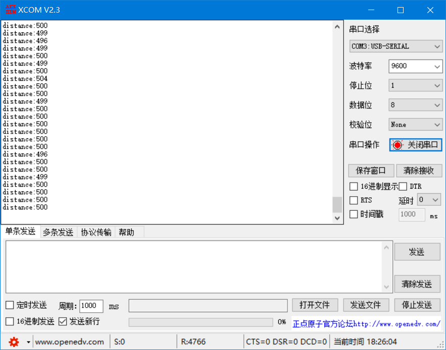

## 基于stm32f10x的超声波测距与蓝牙透传

### 大三下学期的实训项目.题材和智能停车场相关,以下是大致需求:  
+ 超声波传感器测算出与障碍物的距离,并根据距离是否超过阈值来判定车辆是否已经入库
+ 距离数据通过开发板的是蓝牙模块传到上位机
+ 开发板自身需要显示距离信息

### 硬件平台和模块需求
1. stm32f10x 一个
2. 超声波测距器 us-100 一个
3. hc05蓝牙模块 两个
4. 上位机(使用其中一个蓝牙模块接在ttl转usb串口,插在有ch340驱动的pc机上)

### 硬件接线及配置

#### 1. 蓝牙模块
a. 将蓝牙模块和开发板的usb 232连接,重新上电进入AT模式(建议看正点原子的蓝牙模块教学)  
b. 通过串口调试助手来配置第一个蓝牙的参数.波特率设为9600,0,0,密码设为1234,记下蓝牙地址.这个蓝牙将作为**从设备**使用  
c. 同理设置第二个蓝牙.波特率和密码要和前面一样,设置绑定地址为上一个蓝牙的地址,设置为主设备.这个蓝牙将作为**主设备**使用,上电之后会不断尝试配对从设备  
d. 从设备接接在开发板的串口3上,如下图所示.  
  
e. 将主设备接在ttl-usb上,如下图所示  
  

#### 2. 超声波模块
+ 硬件接线如图所示: 使用了开发板的串口1
+ 背部两引脚使用跳线帽短接,使用串口通信方式.发送0x55给传感器,传感器回传两个字节的距离数据

### 运行
+ 打开 USER/distance.uvprojx. 下载代码到开发板
+ 将主设备接入pc机,打开串口调试软件,开发板会不断发送距离信息给电脑

